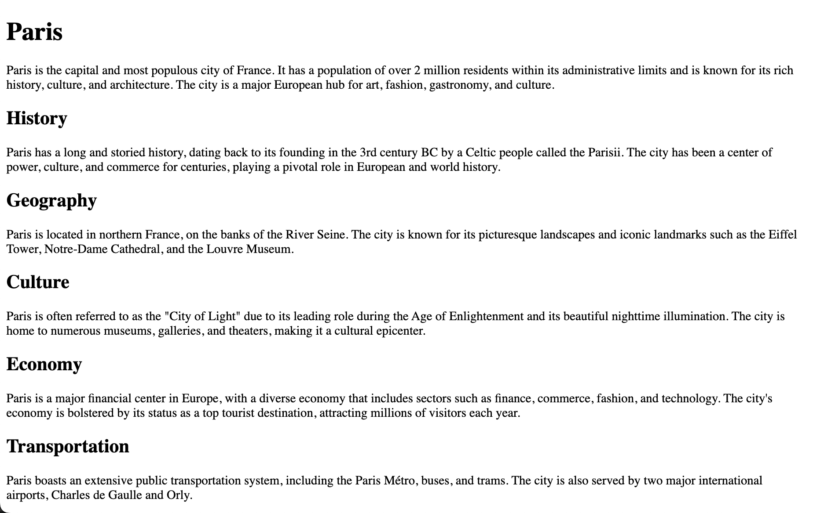
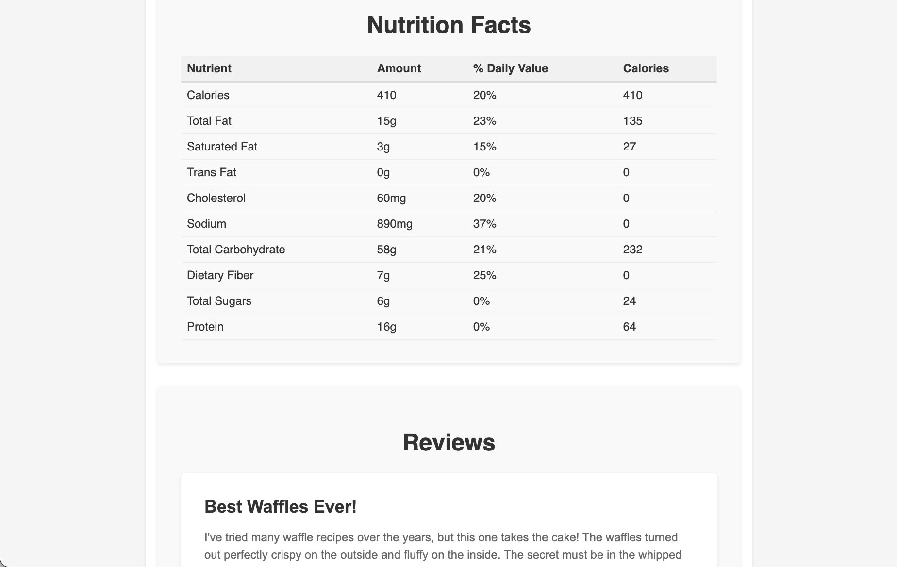

This LLM Internet does Not Exist
================================


**TL;DR**:
We're going to build a web experience dynamically generated by an LLM. This has been done before, for instance [here](https://github.com/LiveOverflow/everything-api) or [here](https://worldsim.nousresearch.com/). However, simply prompting an LLM to create an entire webpage at once doesn't feel authentic. These pages often load very slowly (I mean, *really slowly*) and lack depth in both content and visual appeal.  
In this article, we'll address these shortcomings with a simple trick: instructing the LLM to load parts of the website dynamically.  
**In essence, we're teaching the LLM to delegate tasks to its future self.**


# "Act As" Unlocks New Worlds to Explore
The ability of Large Language Models (LLMs) to paint entire worlds out of thin air using pure language is nothing short of magical. Ask it to play a text adventure, and it will guide you through intricate stories filled with unique characters and settings.
But this magic doesn't stop with role-playing an 17th-century merchant navigating the seas or an astronout exploring the moon's gray and desolate surface.

Ask an LLM to "act like a Linux terminal" and suddenly you're playing a text-based game (or talk to a Linux mimicry) where the commands you type bring a digital adventure to life.
For example, when I tried this, I found myself zapping through a simulated filesystem, hunting for hidden treasures in this world:
```
> cat ~/.hidden/secrets/one-piece-ending.md
cat: /home/user/.hidden/secrets/one-piece-ending.md: No such file or directory
```
Oh snap! No secret ending here.

But why stop at a Linux terminal? Why don't we ask the LLM to directly simulate the entire web? This is exactly what some researchers have been experimenting with. For example, [Nous Research launched a version of this idea in Mar, 2024](https://worldsim.nousresearch.com/) that found more traction in the community.

The basic concept behind this experiment is surprisingly simple. By setting up a proxy server that takes the URL and asks the LLM to generate what it thinks the webpage looks like, you can essentially create an LLM-powered web browser. This simple prompt would already work:
```
Create a response document with content that matches the following URL path: 
    `{{URL_PATH}}`

The first line is the Content-Type of the response.
The following lines is the returned data.
In case of a html response, add relative href links with to related topics.
{{OPTIONAL_DATA}}

Content-Type:
```
Source: [This repository from 2023](https://github.com/LiveOverflow/everything-api).

Finally, you simply open a URL like http://localhost/www.google.com, which reveals a familiar search box. Type in "Secret One Piece Ending Wikipedia," and the LLM generates search results—all based on what it has learned about that URL in its training data. It’s an intriguing experience to explore this LLM-generated non-web.

This is how
- https://www.google.com
- [en.wikipedia.org/wiki/Paris](en.wikipedia.org/wiki/Paris)
- [recipes.com/waffles](recipes.com/waffles)

look like using `gpt-4o`.

<p align="center">
  
  
  
</p>


# A Reality Check: The Limitations of the LLM Web
However, “explore” might be too generous a term. While the concept is fascinating, it quickly becomes clear that the LLM web as implemented above falls short of our expectations. LLMs, by their nature, tend to cut corners. And this is evident when you start interacting with the web pages they generate.

What you’ll notice first is the lack of density in the text—web pages feel shallow, with content that lacks the richness and detail we’re used to. Links are sparse, stripping away the depth that makes the real web such a valuable resource - and rabbit hole at times. The overall style of these pages is another tell: they’re flat, and feel more like the first webpages ever built.

We can improve this a bit by adapting the prompt by asking the LLM what we're actually looking for.
```md
...

Rules:
1. Do not use Markdown Code Blocks. ALWAYS return the website html as plain text.
3. Always inline CSS and (if needed) JS methods to reflect the given URL path.
4. Always provide dense content. Prioritizes rich and dense content and enrich text paragraphs with vast information.
5. Provide links, rabbit-holes and a human touch to emphasize immersion.

Content-Type:
```

<p align="center">
  
  
  
</p>

This helps with style! But the websites are still repetitive and not very rich with their content.
The LLM Version of the Wikipedia article about Paris consists of only 565 words, while the real article on wikipedia consists of ~26k words (depending on if how you count tables and captions, for instance). (We won't get quite that far with our approach - our final version consists only of 2774 words, but still.)
In addition, the added styling of the website does not exactly make the service any faster, as more tokens have to be generated with each call.

This brings us to the real challenge of creating an LLM-powered web: how do we overcome these limitations to build something that feels truly immersive and informative? Making the LLM web richer and denser isn't just about improving the simulation — it’s about strategically adding links to prompt the LLM to cross-reference concepts and, in the process, coax out more detailed and interconnected knowledge. Who knows, with enough clever prodding, we might just trick it into being a little less lazy and a lot more interesting!


## Teaching an LLM to do the work (but later)


<p align="center">
  
  
  
  
</p>
